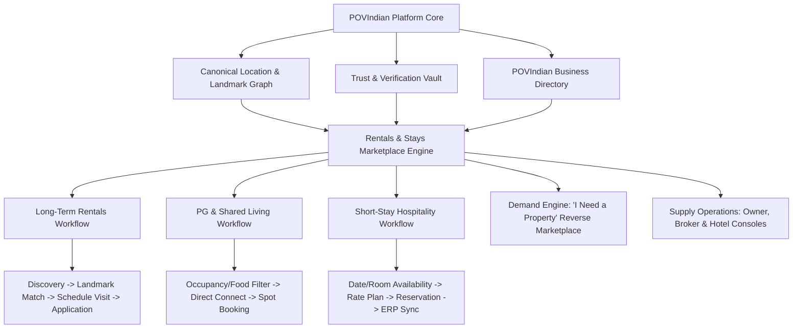
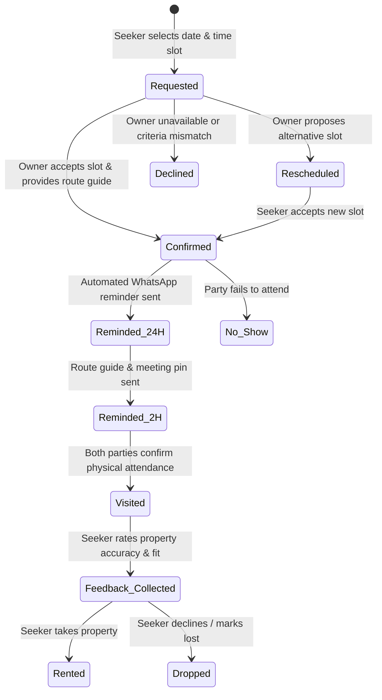
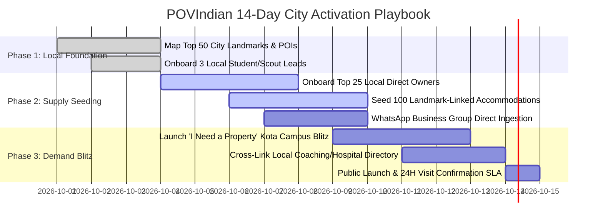

# POVIndian Rentals & Stays
## Product Research, Requirements & Strategic Architecture Document (v2.0 Enhanced)

| Field | Value |
| :--- | :--- |
| **Project** | POVIndian |
| **Product** | Rentals & Stays Platform |
| **Document Version** | 2.0 (Institutional & Bharat-Optimized Edition) |
| **Planning Horizon** | MVP → Phase 2 (Commerce & CRM) → Phase 3 (PropOps & SaaS) → Future Ecosystem |
| **Target Geography** | Pan-India with deep optimization for Tier-2, Tier-3, student hubs, industrial corridors & pilgrimage circuits |
| **Compliance Baseline** | Digital Personal Data Protection Act (DPDP) 2023, Consumer Protection (E-Commerce) Rules 2020, UIDAI Aadhaar Masking Directives, State Police Tenant Verification Guidelines |

---

## 1. Strategic Thesis & The "Bharat Wedge" Moat

### 1.1 The Core Thesis
POVIndian Rentals & Stays solves India’s dual accommodation problem through a **single canonical identity, location, and trust layer** driving two distinct transactional workflows:
1. **Long-Term & Shared Accommodations (Rentals & PGs):** Lead, visit, compatibility match, and lease conversion.
2. **Short-Stay Accommodations (Hotels, Homestays & Serviced Units):** Real-time availability, dynamic rate plans, and reservation conversion.

### 1.2 The Defensible Moat in Tier-2 / Tier-3 India
Existing metro-first portals (99acres, Magicbricks, NoBroker) struggle in non-metro India due to rigid postal-code dependencies, heavy upfront paywalls, broker hostility, and zero awareness of local living nuances. POVIndian wins through four strategic wedges:
* **The Landmark & Topological Knowledge Graph:** Non-metro addresses do not follow house numbers. Discovery is anchored to known POIs ("Behind District Hospital", "Opposite Allen Samyak", "Near Railway Station Platform 1 Exit").
* **Bharat Social Realities as First-Class Filters:** Dietary policies (Pure Veg, Jain-friendly, Non-Veg allowed), bachelor/spinster acceptance, curfew/gate-closing timings, sub-meter electricity rates, and municipal vs tanker water schedules are treated as mandatory indexed fields, eliminating 80% of aborted calls and rental friction.
* **The "I Need a Property" Reverse-Marketplace Engine:** In low-supply towns, demand drives supply. Seekers post structured requests; verified local owners/agents respond with matching inventory.
* **Symbiotic POVIndian Directory Ecosystem:** Properties inherit business authority, local business reviews, nearby amenities (tiffin services, libraries, laundry, coaching hubs), and cross-promotions from the core POVIndian directory.

---

## 2. Indian Ground Realities & Edge-Case Architecture

| Reality / Ground Friction | The Problem in Existing Platforms | POVIndian Architectural Solution |
| :--- | :--- | :--- |
| **Landmark-First Addresses** | Maps place pins kilometers away or fail on missing road names. | **Relational POI Geo-Engine:** Listings link to primary POIs with walking distance, auto-rickshaw fare estimate, and plain-text route guides. |
| **House Number Privacy** | Owners fear unannounced walk-ins, rival broker poaching, or municipal scrutiny. | **Two-Tier Geo-Fencing:** Public maps show approximate 500m radius circle. Exact house/flat number is revealed only upon owner-confirmed visit or application. |
| **Bachelors vs Families Bias** | Bachelors waste hours calling owners only to be rejected over phone/gate. | **Strict Tenant Preference Tagging:** Filterable tags: `Bachelors (Men)`, `Bachelors (Women)`, `Family`, `Students`, `Company Lease`, `Couples Friendly`. |
| **Food & Lifestyle Rules** | Landlords evict tenants over non-veg cooking or late-night entries. | **Structured House Rules Matrix:** `Veg Only`, `Non-Veg Allowed`, `Jain Food Only`, `Alcohol Policy`, `Curfew/Gate Closing Time`, `Opposite Gender Visitors Policy`. |
| **Sub-Meter Power Traps** | Advertised rent of ₹6,000/mo turns into ₹11,000/mo due to ₹12-14/unit commercial electric billing. | **Total Move-in & Running Cost Breakdown:** Mandatory disclosure of: Electricity (Govt meter vs Sub-meter @ ₹X/unit), Water charges, Fixed maintenance, Waste collection. |
| **Security Deposit Disputes** | Landlords withhold 2-10 months deposit upon exit citing false damages. | **Digital Condition Inspection Checklist (Phase 2):** Geo-tagged, timestamped photo report upon move-in and move-out to prevent arbitrary deductions. |
| **Broker Masking as Owner** | Brokers list fake "Zero Brokerage" properties to harvest seeker phone numbers. | **Verified Role Segregation:** Clear UI badges (`Direct Owner`, `Verified Local Broker`, `Property Manager`). Brokers must state brokerage terms (e.g., `15 Days Rent`, `1 Month`, `Fixed Fee`). |
| **Police Verification Hesitation** | Manual paperwork at local police stations causes compliance failures. | **Automated Police Verification Dossier:** One-click pre-filled State Police Tenant Verification Form (PDF generator) compliant with local commissionerate rules. |

---

## 3. Product Overview & System Architecture



### 3.1 Three Tailored Conversion Engines
1. **Long-Term Rental Conversion Engine:**
   * *Primary Conversion:* Schedule Physical Visit / WhatsApp Owner Connect.
   * *Secondary Conversion:* Submit Rental Application / Tenant Match Dossier.
2. **PG & Student Hostel Conversion Engine:**
   * *Primary Conversion:* Direct Warden/Host Call / Reserve Bed Space.
   * *Secondary Conversion:* Book a Taster Meal & Room Inspection.
3. **Short-Stay & Homestay Conversion Engine:**
   * *Primary Conversion:* Real-time Reservation Enquiry or Instant Booking.
   * *Secondary Conversion:* Request Custom Group/Event Pricing.

---

## 4. Property Taxonomy & Deep-Field Matrix

### 4.1 Core Canonical Categories & Units

| Main Family | Canonical Inventory Unit | Sub-Types | Key Indian Attributes |
| :--- | :--- | :--- | :--- |
| **Residential (Long-Term)** | Independent Unit / Flat / House | Studio, 1RK, 1BHK, 2BHK, 3BHK, 4+ BHK, Builder Floor, Independent Kothi/Villa, Penthouse | Floor level, lift backup, balcony count, parking (Covered 4-wheeler, Open 2-wheeler), municipal water timing, power backup (Full, Inverter, None). |
| **Shared & PG** | Bed / Room in Managed Facility | Single Sharing, Double Sharing, Triple Sharing, 4+ Dormitory, Private Room with Shared Bath | Food included (3 meals, Breakfast+Dinner, None), Veg/Jain mess, Wi-Fi speed, Washing machine access, Warden on-site, Study table, Biometric curfew. |
| **Short-Stay Stays** | Room Type / Sellable Nightly Unit | Hotel, Heritage Haveli, Boutique Homestay, Farmstay, Resort, Serviced Apartment | Check-in/out window, local ID policy (Unmarried couples allowed / Local IDs accepted), Extra mattress charges, GST invoice availability, Power backup. |

### 4.2 Dynamic Category Schema Attributes

```json
{
  "common_listing_attributes": {
    "title": "String (Auto-generated fallback from structured fields)",
    "category": "Enum [residential_flat, residential_house, pg_hostel, hotel, homestay, serviced_apt]",
    "rental_model": "Enum [long_term_monthly, pg_shared_monthly, short_stay_nightly]",
    "furnishing_status": "Enum [unfurnished, semi_furnished, fully_furnished]",
    "available_from": "Date / Immediate",
    "minimum_lock_in_months": "Integer",
    "notice_period_days": "Integer"
  },
  "financial_transparency_schema": {
    "base_rent_monthly": "Number (INR)",
    "security_deposit": "Number (INR)",
    "deposit_negotiable": "Boolean",
    "maintenance_monthly": "Number (INR) or Included",
    "brokerage_fee": {
      "applicable": "Boolean",
      "amount_type": "Enum [none, 15_days, 1_month, fixed_amount]",
      "fixed_amount_inr": "Number"
    },
    "utility_billing": {
      "electricity_type": "Enum [govt_direct_meter, sub_meter_fixed_rate, included_in_rent]",
      "electricity_rate_per_unit": "Number (INR)",
      "water_charges_type": "Enum [included, fixed_monthly_split, tanker_billed_actual]"
    }
  },
  "bharat_lifestyle_compatibility_schema": {
    "food_preference": "Enum [pure_veg_only, jain_friendly, non_veg_allowed, no_cooking_restriction]",
    "tenant_preference": "Array [families_only, bachelors_men, bachelors_women, students_only, working_professionals, no_preference]",
    "pet_policy": "Enum [pets_allowed, cats_only, small_dogs_only, strictly_no_pets]",
    "gate_closing_curfew": "String (e.g. '10:30 PM' or '24x7 Open / No Curfew')",
    "guest_entry_policy": "Enum [day_guests_allowed, overnight_allowed, parents_only, no_opposite_gender, no_visitors]",
    "drinking_smoking_policy": "Enum [allowed_in_room, balcony_only, strictly_prohibited]"
  },
  "location_topological_schema": {
    "city_id": "UUID",
    "locality_id": "UUID",
    "primary_landmark": {
      "name": "String",
      "distance_meters": "Integer",
      "walking_time_mins": "Integer",
      "travel_mode": "Enum [walk, e_rickshaw, auto, bus]"
    },
    "approximate_coordinates": {
      "lat": "Float",
      "lng": "Float",
      "accuracy_radius_meters": 500
    },
    "exact_coordinates": {
      "lat": "Float",
      "lng": "Float",
      "stored_privately": true
    },
    "route_guide_hint": "String (e.g., 'Take the road opposite Sharma Sweets, 3rd right beside Shiv Mandir')"
  }
}
```

---

## 5. Location & Landmark Knowledge Graph

### 5.1 Geo-Hierarchy for Indian Towns
1. **Country:** India
2. **State / UT:** (e.g., Rajasthan, Uttar Pradesh, Tamil Nadu)
3. **District:** (e.g., Kota, Varanasi, Coimbatore)
4. **City / Town / Urban Agglomeration:** (e.g., Kota Urban, Dehradun, Tirupati)
5. **Major Locality / Sector / Ward:** (e.g., Talwandi, Rajpur Road, Gandhipuram)
6. **Micro-Pockets / Colonies:** (e.g., Mahaveer Nagar Extension, Vigyan Nagar)
7. **Canonical Landmark / POI:** (e.g., Allen Career Institute Samyak Building, AIIMS Gate 2, City Railway Station Platform 1)
8. **Topological Distance Vector:** Distance, route difficulty, transit availability (E-rickshaws, shared autos).

### 5.2 Approximate Address Privacy Model
* **Search / Grid View:** Pins display an approximate 400m - 600m blurred radius circle.
* **Property Detail Page:** Distance to top 3 landmarks shown explicitly ("350m from Allen Samyak", "800m from City Center Metro").
* **Address Unlocking Milestones:** Exact building name and door number are unlocked **only** when:
  1. The seeker schedules a visit and the owner confirms the slot, OR
  2. The owner accepts an instant chat/contact request on WhatsApp, OR
  3. The seeker completes phone OTP verification and identity check.

---

## 6. The "I Need a Property" Reverse Marketplace Engine

### 6.1 Purpose
In Tier-2/3 cities, 60%+ of quality properties never make it to public classifieds because owners dislike unsolicited calls. Demand-led sourcing flips the funnel: seekers post requirements, and owners/brokers pitch matching units.

### 6.2 Seeker Requirement Posting Flow
1. **Step 1: Locality & Anchor Point**
   * Target City + Anchor Landmark (e.g., "Near Coaching Institute in Kota" or "Near IT Park, Indore").
   * Maximum acceptable commute distance (e.g., "Within 2 km" or "10 mins walking").
2. **Step 2: Category & Household Spec**
   * Category (1BHK / 2BHK / Single Sharing PG / Hotel Room for 5 days).
   * Household profile (Bachelors, Family, Female Student, Corporate Executive).
3. **Step 3: Budget & Timeline**
   * Target monthly rent range (₹Min – ₹Max). Maximum deposit budget.
   * Move-in date & expected stay duration (e.g., "6 months", "11 months", "Flexible").
4. **Step 4: Non-Negotiable Must-Haves**
   * Multi-select chips: `Attached Washroom`, `Power Backup`, `AC`, `Car Parking`, `Veg Mess`, `No Curfew`, `Balcony`.
5. **Step 5: Contact Privacy Settings**
   * Option A: *Masked WhatsApp Connect* (matched providers contact via POVIndian WhatsApp bridge).
   * Option B: *Direct Call via OTP-verified phone*.

### 6.3 Automated Provider Matching & Anti-Spam Control
* **Relevance Filter:** Algorithm filters requirements by city polygon, category match, and budget tolerance (±15%).
* **Cap on Provider Outreach:** Maximum **5 verified providers** can pitch per requirement post to prevent spamming the seeker.
* **Auto-Decay:** Requirement posts automatically expire after **15 days** or upon seeker's "Found a Place" confirmation.

---

## 7. Multi-Tier Trust & Verification Engine

POVIndian does not make deceptive "100% guarantee" claims. It provides clear, verifiable audit tiers:

| Tier Badge | Requirements & Verification Evidence | Display Label | Public Confidence Impact |
| :--- | :--- | :--- | :--- |
| **Tier 1: Phone Verified** | Verified via SMS OTP and WhatsApp active ping. | `Phone Verified` | Baseline spam deterrence. |
| **Tier 2: Role Verified** | Direct Owner (Electricity bill / Municipal property tax receipt) OR Registered Broker (RERA ID / Local Trade License). | `Verified Owner` / `Licensed Broker` | Eliminates ghost listings and impersonation. |
| **Tier 3: Property Audited** | On-site photo audit with GPS timestamp, or live geotagged video walkthrough uploaded by local POVIndian Scout. | `Property Verified & Inspected` | Guarantees room exists, matches photos, and amenities work. |
| **Tier 4: POVIndian Assurance** | Completed legal check (11-month lease agreement template ready) + Rent Escrow / Deposit Dispute support. | `POVIndian Certified Stay` | Premium ranking boost on discovery. |

### 7.1 Freshness & "Dead Listing" Bounty Protocol
* **14-Day Freshness Challenge:** System pings owners via WhatsApp interactive buttons: `[Still Vacant]`, `[Rented Out]`, `[Update Price]`.
* **One-Click Deactivation:** If the owner clicks `[Rented Out]`, listing is archived within 5 seconds.
* **User Community Bounty:** If a seeker visits or calls and reports "Already rented", the seeker receives 50 POVIndian reward points. After 2 unrefuted "Already Rented" flags, the listing is auto-paused.

---

## 8. Schedule Visit & Lead Pipeline Architecture



### 8.1 Visit System Guardrails
* **No Blind Unlocks:** Exact apartment / house number is withheld until owner moves status to `Confirmed`.
* **Meeting Pin Coordination:** The system shares a prominent meeting point (e.g., "Meet at Gate 2 security cabin" or "Opposite Corner Medical Store").
* **Automated Dual-Consent Check:** 2 hours post-visit, both parties receive a 1-tap WhatsApp prompt: *"Did the visit happen?"* to update platform trust scores.

---

## 9. Comprehensive Database Schema (Canonical Entity Matrix)

POVIndian uses a normalized, relational database architecture separating physical properties from publication offers:

```sql
-- 1. Canonical Physical Property
CREATE TABLE properties (
    id VARCHAR(36) PRIMARY KEY,
    owner_id VARCHAR(36) NOT NULL,
    business_id VARCHAR(36) NULL, -- Linked POVIndian Business Directory ID
    property_type ENUM('apartment', 'independent_house', 'villa', 'pg_hostel_building', 'hotel', 'guesthouse') NOT NULL,
    title VARCHAR(255) NOT NULL,
    state VARCHAR(100) NOT NULL,
    city VARCHAR(100) NOT NULL,
    locality VARCHAR(150) NOT NULL,
    sub_locality VARCHAR(150),
    postal_code VARCHAR(10),
    exact_address TEXT,
    exact_latitude DECIMAL(10, 8),
    exact_longitude DECIMAL(11, 8),
    public_latitude DECIMAL(10, 8),
    public_longitude DECIMAL(11, 8),
    primary_landmark_name VARCHAR(255),
    landmark_distance_meters INT,
    geo_confidence ENUM('exact_gps', 'landmark_derived', 'locality_approximate') DEFAULT 'landmark_derived',
    created_at TIMESTAMP DEFAULT CURRENT_TIMESTAMP
);

-- 2. Marketplace Publication Wrapper (Listing)
CREATE TABLE listings (
    id VARCHAR(36) PRIMARY KEY,
    property_id VARCHAR(36) NOT NULL,
    lister_user_id VARCHAR(36) NOT NULL,
    lister_role ENUM('direct_owner', 'authorized_agent', 'property_manager', 'hospitality_operator') NOT NULL,
    rental_model ENUM('long_term_monthly', 'pg_shared_monthly', 'short_stay_nightly') NOT NULL,
    furnishing ENUM('unfurnished', 'semi_furnished', 'fully_furnished') NOT NULL,
    bhk_type ENUM('room', '1rk', '1bhk', '2bhk', '3bhk', '4bhk_plus', 'bed_space') NOT NULL,
    monthly_rent DECIMAL(10, 2),
    nightly_rate DECIMAL(10, 2),
    security_deposit DECIMAL(10, 2) DEFAULT 0.00,
    maintenance_monthly DECIMAL(10, 2) DEFAULT 0.00,
    brokerage_terms VARCHAR(100) DEFAULT 'zero_brokerage',
    electricity_charge_type ENUM('govt_meter', 'sub_meter_fixed', 'included_in_rent') DEFAULT 'govt_meter',
    electricity_rate_per_unit DECIMAL(5, 2) DEFAULT 0.00,
    water_source ENUM('municipal_24x7', 'municipal_timed', 'borewell', 'water_tanker') DEFAULT 'municipal_timed',
    food_preference ENUM('pure_veg_only', 'jain_friendly', 'non_veg_allowed', 'no_restriction') DEFAULT 'no_restriction',
    tenant_preference JSON, -- ['family', 'bachelors_men', 'bachelors_women', 'students']
    pet_policy ENUM('allowed', 'cats_only', 'small_dogs', 'prohibited') DEFAULT 'prohibited',
    gate_closing_time VARCHAR(50) DEFAULT 'No Curfew',
    visitor_policy VARCHAR(100) DEFAULT 'Day visitors allowed',
    available_from DATE,
    status ENUM('draft', 'under_review', 'active', 'needs_refresh', 'paused', 'rented_out', 'archived') DEFAULT 'draft',
    verification_tier ENUM('none', 'phone_verified', 'role_verified', 'property_inspected', 'pov_certified') DEFAULT 'phone_verified',
    last_freshness_confirmed_at TIMESTAMP DEFAULT CURRENT_TIMESTAMP,
    created_at TIMESTAMP DEFAULT CURRENT_TIMESTAMP,
    FOREIGN KEY (property_id) REFERENCES properties(id) ON DELETE CASCADE
);

-- 3. Room Inventory & Rate Plans (For PGs and Hotels)
CREATE TABLE room_types (
    id VARCHAR(36) PRIMARY KEY,
    listing_id VARCHAR(36) NOT NULL,
    room_name VARCHAR(100) NOT NULL, -- e.g., 'Deluxe AC Room' or 'Double Sharing PG Room'
    total_inventory INT NOT NULL DEFAULT 1,
    base_occupancy INT NOT NULL DEFAULT 1,
    max_occupancy INT NOT NULL DEFAULT 2,
    base_rate_nightly DECIMAL(10, 2),
    base_rent_monthly DECIMAL(10, 2),
    has_attached_bathroom BOOLEAN DEFAULT TRUE,
    has_ac BOOLEAN DEFAULT TRUE,
    has_balcony BOOLEAN DEFAULT FALSE,
    FOREIGN KEY (listing_id) REFERENCES listings(id) ON DELETE CASCADE
);

-- 4. Visits & Walkthrough Appointments
CREATE TABLE visits (
    id VARCHAR(36) PRIMARY KEY,
    listing_id VARCHAR(36) NOT NULL,
    seeker_user_id VARCHAR(36) NOT NULL,
    preferred_date DATE NOT NULL,
    preferred_time_slot VARCHAR(50) NOT NULL,
    attendees_count INT DEFAULT 1,
    meeting_point_instructions TEXT,
    status ENUM('requested', 'confirmed', 'rescheduled', 'completed', 'cancelled_by_seeker', 'declined_by_owner', 'no_show') DEFAULT 'requested',
    reschedule_reason TEXT,
    seeker_feedback_score INT,
    seeker_feedback_notes TEXT,
    created_at TIMESTAMP DEFAULT CURRENT_TIMESTAMP,
    FOREIGN KEY (listing_id) REFERENCES listings(id) ON DELETE CASCADE
);

-- 5. "I Need a Property" Demand Records
CREATE TABLE requirement_posts (
    id VARCHAR(36) PRIMARY KEY,
    seeker_user_id VARCHAR(36) NOT NULL,
    city VARCHAR(100) NOT NULL,
    preferred_locality VARCHAR(150),
    anchor_landmark VARCHAR(255),
    max_distance_km DECIMAL(4, 1) DEFAULT 3.0,
    rental_model ENUM('long_term_monthly', 'pg_shared_monthly', 'short_stay_nightly') NOT NULL,
    bhk_preference JSON, -- ['1bhk', '2bhk']
    budget_min DECIMAL(10, 2),
    budget_max DECIMAL(10, 2) NOT NULL,
    household_type ENUM('family', 'bachelors_men', 'bachelors_women', 'student', 'working_prof') NOT NULL,
    food_preference ENUM('pure_veg_only', 'jain_friendly', 'non_veg_allowed', 'no_restriction') DEFAULT 'no_restriction',
    must_have_amenities JSON, -- ['ac', 'attached_bath', 'parking', 'no_curfew']
    move_in_date DATE NOT NULL,
    expected_stay_months INT DEFAULT 11,
    contact_privacy ENUM('masked_whatsapp', 'direct_phone') DEFAULT 'masked_whatsapp',
    status ENUM('active', 'matched', 'closed_found', 'expired') DEFAULT 'active',
    max_responses_allowed INT DEFAULT 5,
    current_responses_count INT DEFAULT 0,
    expires_at TIMESTAMP NOT NULL,
    created_at TIMESTAMP DEFAULT CURRENT_TIMESTAMP
);
```

---

## 10. Monetization Strategy for Bharat (Zero-Friction Sachet Model)

Rather than copying Western subscription fees or charging heavy 1-month brokerage commissions, POVIndian uses a **high-velocity sachet revenue model**:

```
+-----------------------------------------------------------------------------------+
|                        POVIndian Monetization Architecture                        |
+-----------------------------------------------------------------------------------+
|                                                                                   |
|  [ FREE TIER FOR INDIVIDUAL OWNERS ]                                             |
|  - 1 Active Property Listing Free Forever                                         |
|  - Unlimited Direct WhatsApp Enquiries                                           |
|  - Standard Search Placement                                                      |
|                                                                                   |
|  [ SACHET PAY-PER-USE REVENUE ]                                                   |
|  - "Instant Match Unlock": Verified Brokers pay ₹29 - ₹49 to unlock 1 verified    |
|    "I Need a Property" seeker requirement.                                        |
|  - "Scout Physical Audit": ₹399 one-time fee for a POVIndian Local Scout to      |
|    visit the house, capture HDR photos, verify coordinates & badge it 'Audited'. |
|  - "7-Day Featured City Boost": ₹199 to pin property atop local landmark searches.|
|                                                                                   |
|  [ HOSPITALITY COMMERCE (Short-Stays & Stays) ]                                   |
|  - 6% - 10% commission on confirmed stays (vs 18% - 25% charged by MakeMyTrip/OTA)|
|  - Direct Hotel ERP Sync Integration: ₹499/month for small independent lodges.    |
|                                                                                   |
|  [ PHASE 2/3 SAAS & ANCILLARY SERVICES ]                                          |
|  - Legally compliant Digital 11-Month Rental Agreement + e-Stamp (Govt stamp fee  |
|    + ₹149 convenience fee).                                                       |
|  - Automated Police Tenant Verification Dossier: ₹99 pre-formatted generator.    |
+-----------------------------------------------------------------------------------+
```

---

## 11. Regulatory, DPDP Act 2023 & Security Architecture

1. **Digital Personal Data Protection (DPDP) Act 2023 Compliance:**
   * **Explicit Purpose-Limited Consent:** Phone numbers and IDs are gathered strictly for tenant-owner matching and never sold to third-party telemarketers.
   * **Aadhaar Masking Directive:** Never store 12-digit unmasked Aadhaar numbers. The document upload pipeline runs an automated edge-redaction function that blackens the first 8 digits, storing only the masked image and last 4 digits in accordance with UIDAI regulations.
   * **Right to Erasure & Deactivation:** Deleting an account strips all PII (names, phone numbers, identity docs) from active storage within 72 hours, leaving only anonymized audit hashes.
2. **Police Verification Compliance:**
   * Automated generation of official State Police Tenant Verification Form (Form A / Form 2) with pre-filled tenant and owner details, photo placeholders, and emergency contacts.
3. **Consumer Protection (E-Commerce) Rules 2020:**
   * Transparent upfront pricing: no hidden convenience fees at the final step. Stays show total pricing inclusive of GST and local taxes.
   * Prominent grievance officer contact details and mandatory 48-hour response SLA.

---

## 12. Go-To-Market (GTM) Tier-2/3 City Launch Playbook

To activate a new Tier-2 city (e.g., Kota, Indore, Coimbatore, Dehradun) within **14 calendar days**:



* **Step 1: The Landmark Census (Days 1–3):** Map the 50 most searched non-postal landmarks (coaching campuses, medical colleges, tech hubs, industrial gates).
* **Step 2: The Local Scout Network (Days 2–5):** Recruit 2–3 college students or local contributors as verified "POVIndian Scouts" to conduct physical audits and assist non-tech-savvy owners with listing.
* **Step 3: WhatsApp Assisted Listing Bot (Days 6–9):** Owners can list a property in 90 seconds by texting photos, rent, and landmark location to the POVIndian WhatsApp Bot.
* **Step 4: Demand-First Campus & Industrial Tie-ups (Days 10–14):** Distribute QR codes outside institutions with the CTA: *"Looking for a room nearby without brokerage? Post your requirement in 60 seconds."*

---

## 13. Phased Implementation Roadmap

### Phase 1: MVP (Launch Ready)
* [x] Core PHP frontend + Express/MySQL backend with database connection.
* [x] Landmark-aware search engine with intent switcher (`Rent`, `PG & Shared`, `Stays`).
* [x] Dynamic filter drawer (Rent, BHK, Furnishing, Preferred Tenant, Curfew, Food).
* [x] High-conversion Property Detail Page (PDP) with cost transparency and address privacy.
* [x] Schedule Visit interactive workflow with slot confirmation and reminders.
* [x] Basic "I Need a Property" requirement form with location anchor.
* [x] Direct WhatsApp and phone call conversion tracking.
* [x] Admin dashboard with listing moderation and visit tracking.

### Phase 2: Commerce & Trust (Month 2–3)
* [ ] Automated WhatsApp interactive bot for listing onboarding and freshness checks.
* [ ] Reverse Marketplace match engine: Instant alerts to top 5 verified providers when matching requirement is posted.
* [ ] Scout verification workflow: Geotagged photo upload with automated EXIF/GPS coordinate matching.
* [ ] Masked virtual number calling / WhatsApp privacy bridge.
* [ ] Verified short-stay reservation engine with atomic room inventory decrement.
* [ ] Move-in Condition Inspection photo checklist (Phase 2 deposit protection).

### Phase 3: Operations & SaaS (Month 4–6)
* [ ] Hotel ERP / PMS bi-directional sync (ARI: Availability, Rates, Inventory).
* [ ] Digital 11-Month Rental Agreement generator with e-Sign / Aadhaar OTP integration.
* [ ] Automated State Police Tenant Verification Form PDF generator.
* [ ] UPI AutoPay recurring rent collection integration via regulated payment gateway partner.
* [ ] Property manager multi-unit portfolio dashboard.

---

## 14. Non-Functional & Device Resilience Benchmarks

* **Device Target:** Smooth performance on ₹8,000–₹12,000 Android devices (Snapdragon 680 / Helio G85 equivalent, 4GB RAM).
* **Bandwidth Optimization:** WebP image transcoding with max 80KB hero payload and progressive lazy-loading on 3G/4G networks.
* **Offline & Network Resiliency:** Forms cache drafts in browser `localStorage` to prevent lost data during intermittent network drops.
* **API Idempotency:** State-changing endpoints (`POST /api/v1/visits`, `POST /api/v1/requirements`, `POST /api/v1/reservations`) enforce unique client-generated UUID idempotency keys to prevent duplicate leads on double-taps.
